Dices detection
=========================================
**Komunikacja człowiek-komputer 2021**  

**Authors**: Katarzyna Badio, Julia Chabora  


# Approach to the problem

### 1. Checking whether dices dots are inside the dices box.
        After classifying dices and dots by checking their area, the algorithm which detected if dots were inside dices contours was ran. This action filtered small rectangles outside of dices.

### 2. Counting average value ('middle') of all detected boxes.  

### 3. Averages of dices areas and dices dots areas.
        After the first step in soultion, dices and dices dots were classified by labelling areas of boxes as follows: if the area was greater than the 'middle' value, then it was a dice, else it was dices' dot. Then these values were used to classify dots and dices by changing values which distinguished objects.    

        Results for the 100_dices folder:
            Average area of dices dots:  81.31931317543793   
            Average area of dices:  1888.6862380952382   

### 4. Checking proportions of a bounding box.
        Then, still small boxes were present inside some dices. Also some areas of photos where there was a spotlight, were recognized as dices. Checking proportions of boxes was applied and it helped to filter unwanted objects even more.


# Plots 
# Folder containing images: 100_dices
#### Folder containing preprocessed images: preprocessed_100_dices
#### Folder containing final images: processed_100_images
<!-- ## - dataset = 100_dices.csv 
## - result dataset = results_100_dices.csv  -->

## a) Results when using 1 & 2 approach to the problem.
>blur edge size = (3, 3)         
threshold value = 120           
erosion = (1, 1)        
dilation = (3, 3)       

```
area < avg area -> kostka
area >= avg area -> oczko
```

### a.1) All dices were recognized correctly.  

Before proprocessing:   
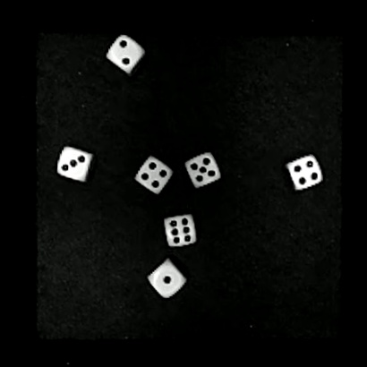  
After preprocessing:   
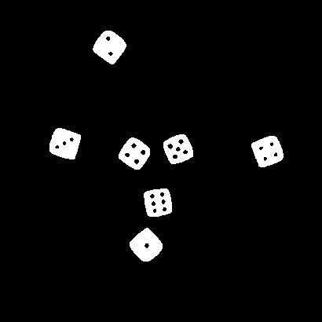   
Final picture:   
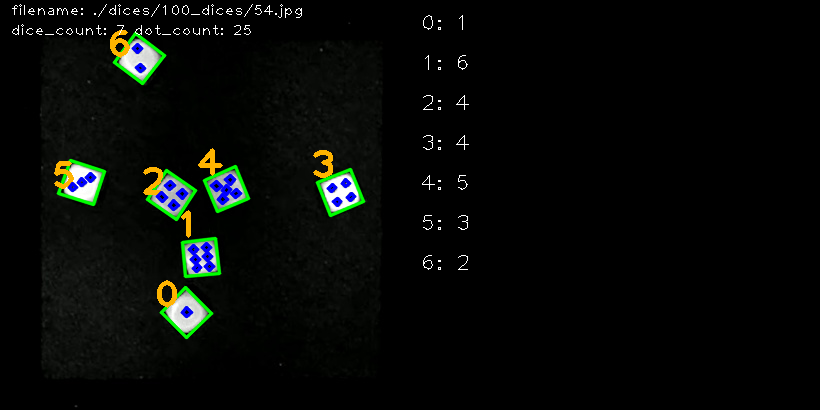     


### a.2) All dices except '3' were recognized correctly. Instead of recognizing '3' as a dice with six dots, algorithm counted three.


Before proprocessing:   
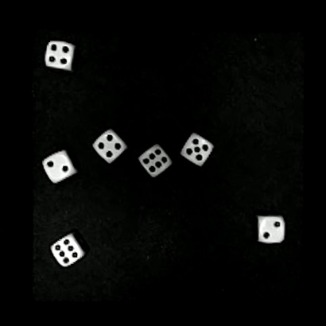  
After preprocessing:   
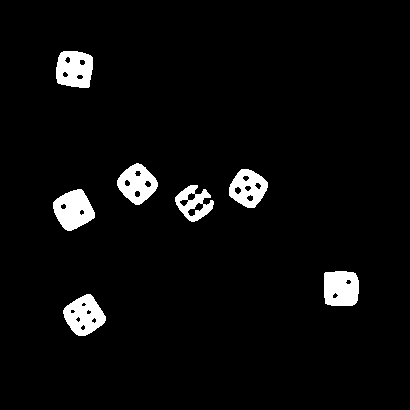   
Final picture:
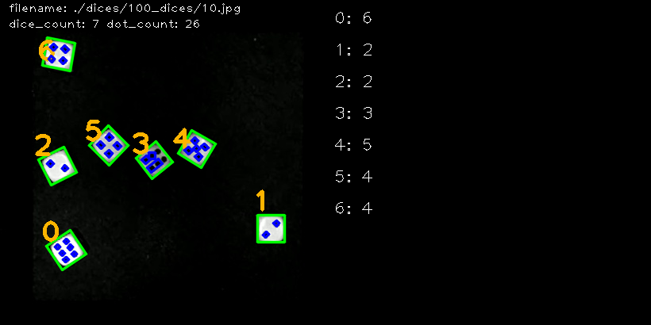     
    

### a.3) All dices except '3' were recognized correctly. Instead of recognizing '3' as a dice with six dots, algorithm counted three.

Before preprocessing:  
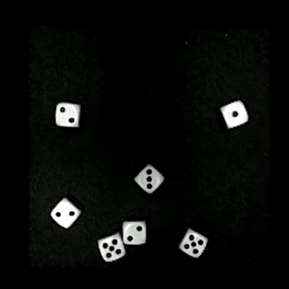  
After preprocessing:  
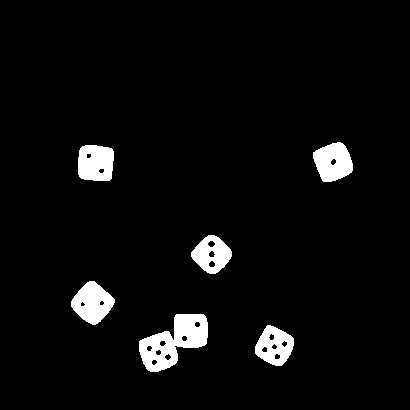    
Final picture:  
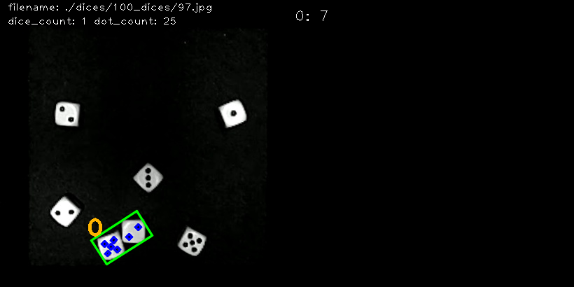   


* Results:

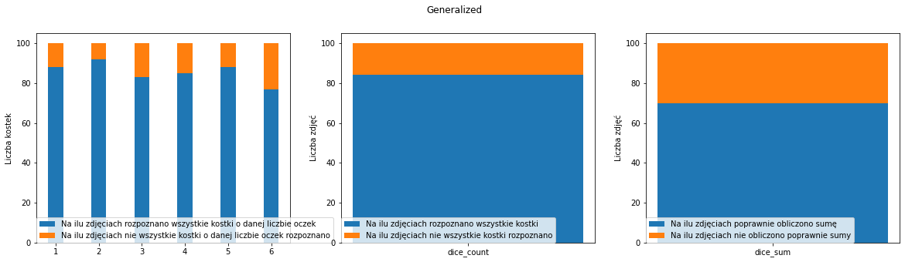
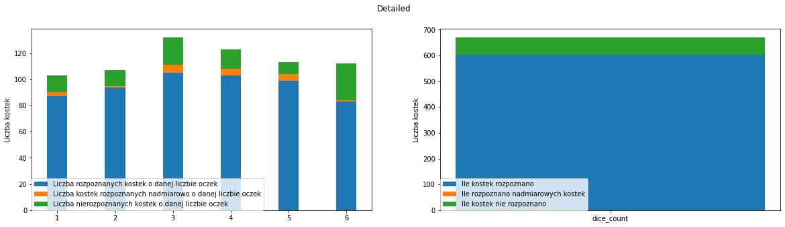


## b) Results when using 1 & 2 & 3 approach to the problem.
Using trial and error method, the 'middle' value which determined whether on the picture was dice or dot, was calculated.


>blur edge size = (3, 3)         
threshold value = 120           
erosion = (1, 1)        
dilation = (3, 3)  
```
area > 1000 -> kostka
area < 100 -> oczko
else -> none
```
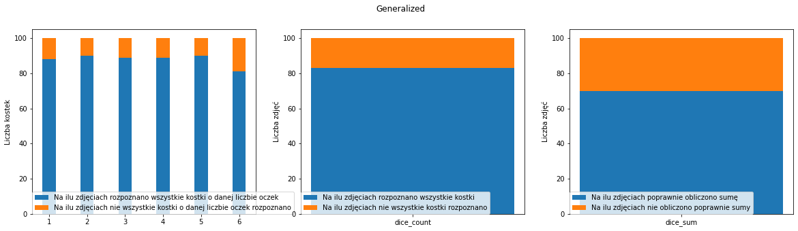
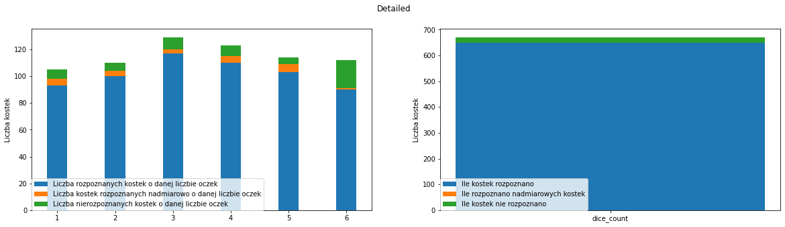

